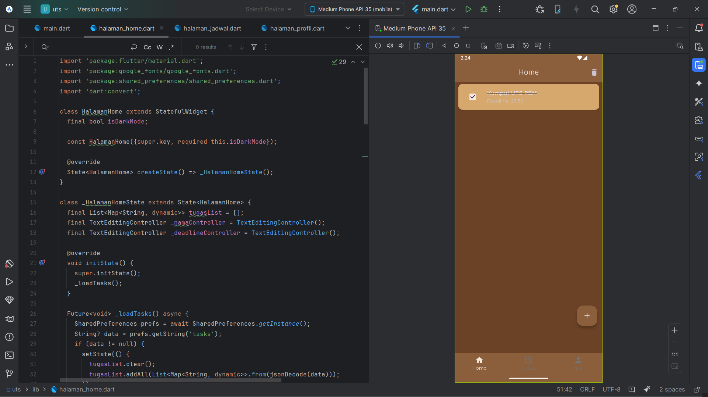
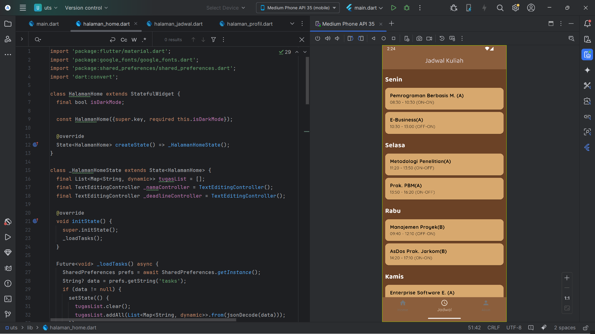
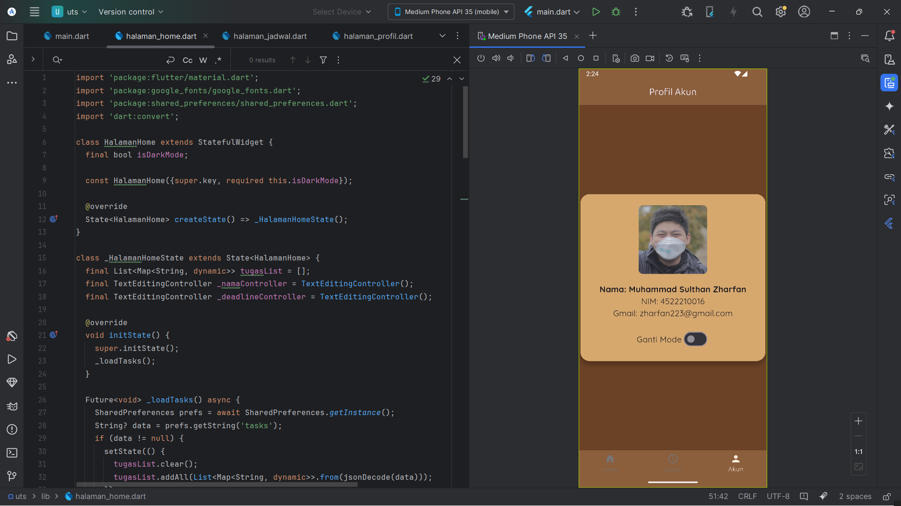
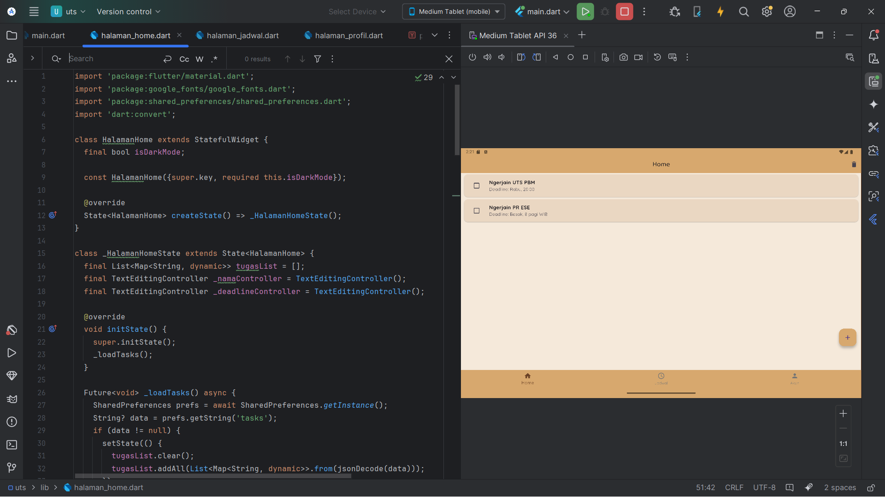
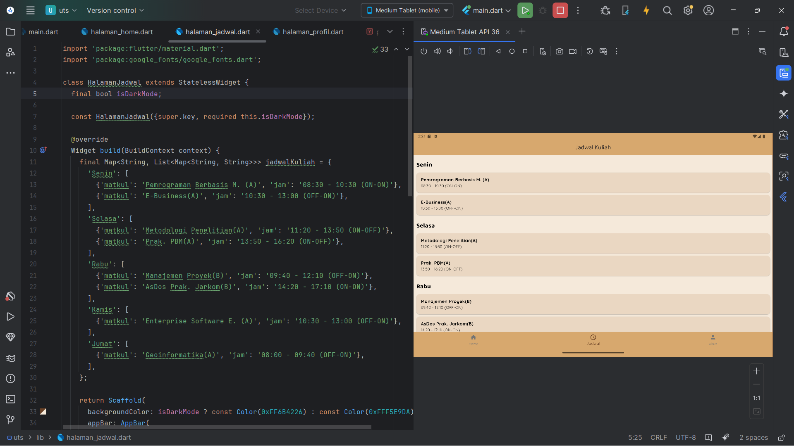
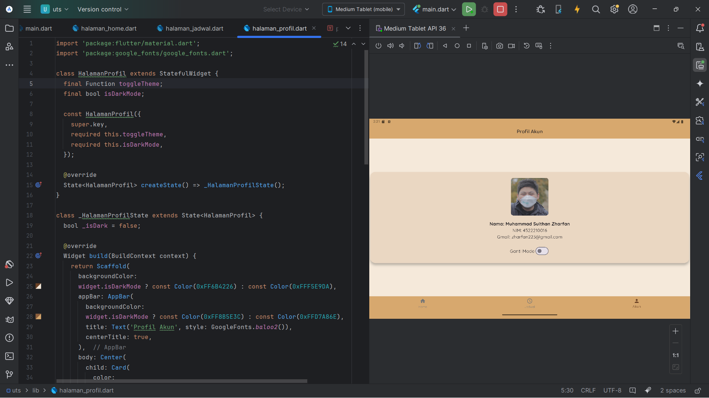

#  UTS Pemrograman Berbasis Mobile  

icon | Nama | NPM |
:---: | :---: | :---: 
| Muhammad Sulthan Zharfan | 4522210016 | `SultanZharfan`
---

## 📝 Deskripsi

Ini adalah repository untuk tugas **UTS Pemrograman Berbasis Mobile (PBM)**. Di dalamnya berisi seluruh source code dan dokumentasi dari proyek yang saya kerjakan. Tujuannya adalah untuk memenuhi salah satu syarat UTS Semester 6 di Universitas Pancasila.

---

## 🔥 Link Youtube
```bash
git clone https://github.com/SulthanZharfan/UTS_PBM.git
```

---

## 🚀 Cara Menjalankan:

1. Clone repository ke komputer/laptop.
2. Buka folder project menggunakan Android Studio atau VSCode.
3. Jalankan perintah `flutter pub get` untuk menginstall semua dependency.
4. Hubungkan emulator atau device fisik.
5. Jalankan aplikasi dengan klik tombol **Run** di Android Studio/VSCode atau gunakan perintah `flutter run` di terminal.

**Clone repository:**

```bash
git clone https://github.com/SulthanZharfan/UTS_PBM.git
```

## 🚀 Cara Kerja Aplikasi

Aplikasi ini merupakan **aplikasi manajemen tugas/jadwal** berbasis mobile yang dibuat dengan Flutter. Alur penggunaan aplikasi secara singkat:

**Halaman Utama:**
   - Menampilkan daftar tugas/jadwal yang sudah dibuat.
   - User dapat melihat tugas yang masih pending & yang sudah selesai.

**Menambahkan Tugas:**
   - Klik tombol "+" untuk menambah tugas baru.
   - Isi detail tugas seperti judul & deadline.
   - Simpan tugas ➔ otomatis muncul di halaman utama.

**Mengedit/Menghapus Tugas:**
   - Swipe/klik pada tugas untuk mengedit atau menghapus.
   - Update status tugas (selesai/belum).

**Mode Dark/Light:**
   - User dapat toggle antara mode dark & light untuk kenyamanan.

---

> ✨ **Fitur Utama:**
> - Manajemen tugas sederhana & cepat.
> - Responsive untuk mobile & tablet.
> - UI bersih & mudah digunakan.

## 📸 SS Kodingan

Berikut adalah screenshot dari hasil kodingan saya di berbagai device:

### 📱 Mobile View (DARK MODE)

#### SS 1


#### SS 2


#### SS 3


---

### 🖥️ Tablet View(LIGHT MODE)

#### SS 1


#### SS 2


#### SS 3



---

End
